<div align="center">
  
**👋 Soroush Eghdami**
 
[](https://github.com/Soroush-Eghdami)
<br>

[](mailto:Soroush.egh@gmail.com)
[](https://t.me/inairplanemode)
[](https://www.instagram.com/soroush_eghdami_/)
[](https://bsky.app/profile/sorousheghdami.bsky.social)

<!--  -->

</div>

<br>

<details open>
  <summary align="center">
      <samp>
        <b style="font-size: 15pt;">About Me</b>
      </samp>
  </summary>

  <br>

```python
class Soroush:
    def __init__(self):
        self.name = "Soroush Eghdami"
        self.role = "Python Backend Developer"
        self.education = {
            "field": "Computer Engineering",
            "current_courses": ["Operating Systems", "Computer Vision"]
        }
        self.stack = ["Python", "Django", "REST APIs", "Docker", "PostgreSQL"]
        self.currently_exploring = "AI-powered RAG systems"
        self.fun_fact = self.needs_coffee()

    def needs_coffee(self):
        return "☕ always" if True else "😴"

soroush = Soroush()
```

<br>

- 🚀 Building real-world backend projects with **Python**, **Django**, and **REST APIs**
- 🎓 Studying Computer Engineering — currently deep in Operating Systems and Computer Vision
- 🧠 Exploring **AI/ML**, RAG (Retrieval-Augmented Generation) systems, and backend architecture
- ⚙️ Comfortable with **Python, Django, PostgreSQL, MongoDB, Docker, Git**
- 🔭 Currently working on full-stack apps like a Twitter clone and a cake shop web app
- 🤝 Open to collaborating on impactful, well-engineered projects

<br><br>

<h1 align="center">🛠️ Tech Stack</h1>

<div align="center">

**Languages & Frameworks**


**Databases & Caching**


**DevOps & Tools**


</div>

<br><br>

<h1 align="center">📊 GitHub Stats</h1>

<div align="center">


<br>

</div>

<br><br>

<h1 align="center">📌 Featured Projects</h1>

<div align="center">

[](https://github.com/Soroush-Eghdami/R.A.G)
[](https://github.com/Soroush-Eghdami/Tweeter_Demo)
<br>
[](https://github.com/Soroush-Eghdami/Online-shop-CBV)
[](https://github.com/Soroush-Eghdami/Summerizer)

</div>

<br><br>

<h1 align="center">📫 Contact Me</h1>

```json
{
  "Email": "Soroush.egh@gmail.com",
  "Telegram": "@inairplanemode",
  "Instagram": "@soroush_eghdami_",
  "Bluesky": "sorousheghdami.bsky.social"
}
```

</details>

<br>

<div align="center"><i>Let's build something great together!</i></div>
